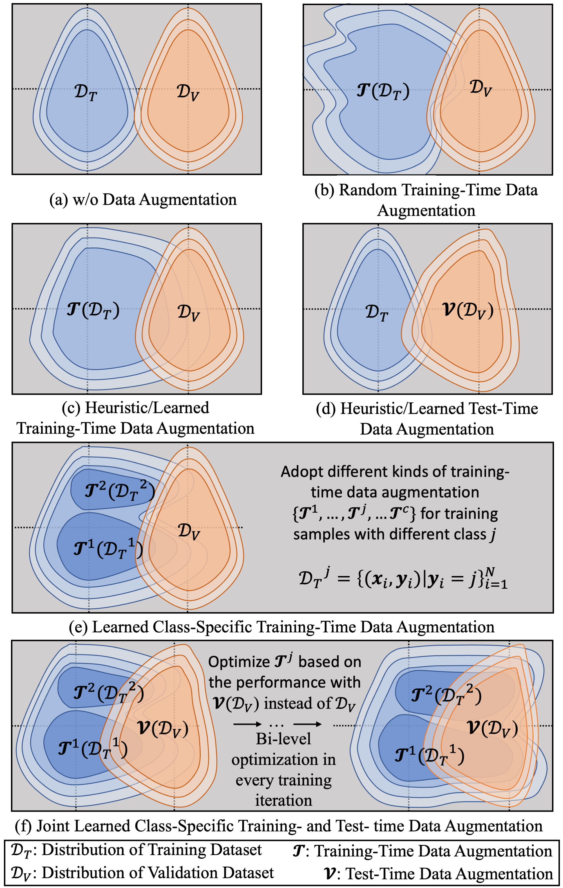

## Introduction

In this work, we improve the current data augmentation strategies for image segmentation with two designs. First, we learn class-specific training-time data augmentation (TRA) effectively increasing the heterogeneity within the training subsets and tackling the class imbalance common in segmentation. Second, we jointly optimize TRA and test-time data augmentation (TEA), which are closely connected as both aim to align the training and test data distribution but were so far considered separately in previous works. We demonstrate the effectiveness of our method on multiple medical image segmentation tasks across different scenarios including multi-domain segmentation and domain generalized segmentation.

<br/> <div align=center></div>

## Requirements

This code was developed with `python==3.10`.

```
ipykernel==6.9.1
simpleitk==2.2.1
scipy==1.9.1
matplotlib==3.6.3
torch==1.12.1
torchvision==0.13.1
nibabel==2.4.1
future==0.18.2
threadpoolctl==2.1.0
tensorboard_logger==0.1.0
tensorboard==2.9.0
tensorflow==2.9.1
future==0.18.2
threadpoolctl==2.1.0
pandas==1.5.2
scikit-image==0.19.3
einops==0.6.0
timm==0.6.12
```

## Data and preprocessing

Download medical images with the following links: [ATLAS](http://fcon_1000.projects.nitrc.org/indi/retro/atlas.html), [KiTS19](https://github.com/neheller/kits19), [organ CT](https://www.synapse.org/#!Synapse:syn3193805/wiki/217789), [cross-site prostate MRI](https://liuquande.github.io/SAML/), [cross-sequence cardiac MRI](http://www.sdspeople.fudan.edu.cn/zhuangxiahai/0/mscmrseg19/data.html) and [cross-ste cardiac MRI](https://www.ub.edu/mnms/).

We provide some preprocessing scripts for some of the MRI or CT datasets. Please download the datasets to `./datadownload/` and refer to `datapreprocessing_KiTS.ipynb`, `datapreprocessing_Prostate.ipynb` and `datapreprocessing_MnMCardiac.ipynb`. The results would be saved in `./datapreprocessed`.

Note that the readers could refer to the data files described in `./datafiles` to prepare their own data.

## Training
Here, I show an example of training scripts for kidney tumor segmentation using 50% training data based on different segmentation models and data augmentation strategies.

### DeepMedic
1. Training without training-time data augmentation.
```
python train_Deepmedic.py --name Deepmedic_vanilla_Kits_50percent --tensorboard --split 0 --epochs 2000 --dropoutrate 0.5 --sgd0orAdam1orRms2 0 --kits0pros1 0 --det --vanilla --gpu 0
```

2. Training with heurstic training-time data augmentation.
```
python train_Deepmedic.py --name Deepmedic_heuristic_Kits_50percent --tensorboard --split 0 --epochs 2000 --dropoutrate 0.5 --sgd0orAdam1orRms2 0 --kits0pros1 0 --org 3 --softdsc 1 --wotsmeta --wotrmeta --det --gpu 0
```

3. Training with learned training-time data augmentation.
```
python train_Deepmedic.py --name Deepmedic_learned_Kits_50percent --tensorboard --split 0 --epochs 2000 --dropoutrate 0.5 --sgd0orAdam1orRms2 0 --arch_learning_rate 1e-3 --kits0pros1 0 --org 3 --softdsc 1 --wotsmeta --det --gpu 0
```

4. Training with learned class-specific training-time data augmentation.
```
python train_Deepmedic.py --name Deepmedic_learnedCS_Kits_50percent --tensorboard --split 0 --epochs 2000 --dropoutrate 0.5 --sgd0orAdam1orRms2 0 --arch_learning_rate 1e-3 --kits0pros1 0 --org 3 --softdsc 1 --wotsmeta --cs --det --gpu 0
```

5. Optimizing the test-time data augmentation policies. Here, we load the segmentation model from `SAVE_PATH/checkpoint.pth.tar` and do not update the model parameters.
```
python train_Deepmedic.py --name Deepmedic_Kits_learnedTEA --tensorboard --split 0 --epochs 10 --dropoutrate 0.5 --archts_learning_rate 5e-3 --printevery 1 --kits0pros1 0 --orgts 4 --wotrmeta --woupdate --det --resume SAVE_PATH/checkpoint.pth.tar --startover --gpu 0
```

6. Jointing optimization of class-specific training-time data augmentation and test-time data augmentation.
```
python train_Deepmedic.py --name Deepmedic_JCSAugment_Kits_50percent --tensorboard --split 0 --epochs 2000 --dropoutrate 0.5 --sgd0orAdam1orRms2 0 --arch_learning_rate 1e-3 --archts_learning_rate 5e-5 --kits0pros1 0 --org 3 --orgts 2 --softdsc 1 --cs --det --gpu 0
```

Note that we can set augupdate larger than 1 to comtrol the update frequency of training-time data augmentation policies, save the training time. Please remember to increase the learning rate for meta-learning correspondingly.

### 3D U-Net

1. Training with heurstic training-time data augmentation.
```
python train_Unet.py --name 3DUNet_heuristic_Kits_50percent --tensorboard --split 0 --features 10 --downsampling 4 --deepsupervision --patch-size 64 64 64 --epochs 2000 --sgd0orAdam1orRms2 0 --kits0pros1 0 --org 2 --wotsmeta --wotrmeta --det --gpu 0
```

2. Optimizing the test-time data augmentation policies. Similarly, we load the segmentation model from `SAVE_PATH/checkpoint.pth.tar` and do not update the model parameters.
```
python train_Unet.py --name 3DUNet_Kits_learnedTEA --tensorboard --split 0 --features 10 --downsampling 4 --deepsupervision --patch-size 64 64 64 --epochs 10 --archts_learning_rate 5e-3 --printevery 1 --kits0pros1 0 --orgts 2 --wotrmeta --woupdate --det --resume SAVE_PATH/checkpoint.pth.tar --startover --gpu 0
```

3. Jointing optimization of class-specific training-time data augmentation and test-time data augmentation.
```
python train_Unet.py --name 3DUNet_JCSAugment_Kits_50percent --tensorboard --split 0 --features 10 --downsampling 4 --deepsupervision --patch-size 64 64 64 --epochs 2000 --sgd0orAdam1orRms2 0 --arch_learning_rate 5e-4 --archts_learning_rate 5e-5 --kits0pros1 0 --org 2 --orgts 2 --softdsc 2 --cs --det --gpu 0
```

### Transformer (nnFormer)

1. Training with heurstic training-time data augmentation.
```
python train_nnformer.py --name nnformer_heuristic_Kits_50percent --tensorboard --split 0 --downsampling 3 --deepsupervision --patch-size 64 64 64 --epochs 2000 --sgd0orAdam1orRms2 0 --kits0pros1 0 --org 5 --wotsmeta --wotrmeta --det --gpu 0
```

2. Jointing optimization of class-specific training-time data augmentation and test-time data augmentation.
```
python train_nnformer.py --name nnformer_JCSAugment_Kits_50percent --tensorboard --split 0 --downsampling 3 --deepsupervision --patch-size 64 64 64 --epochs 2000 --sgd0orAdam1orRms2 0 --arch_learning_rate 2e-3 --archts_learning_rate 5e-5 --kits0pros1 0 --org 5 --orgts 2 --softdsc 0 --cs --det --gpu 0
```

Note that the users might want to refer the hyperparameters (especially meta-learning learning rate, network settings) to our manucript and supplementary material.

## Inference

### DeepMedic

1. Inference without test-time data augmentation with model parameters saved in `SAVE_PATH/checkpoint.pth.tar`.
```
python test_Deepmedic.py --resume SAVE_PATH/checkpoint.pth.tar --name Deepmedic_Kits_wo_TEA --kits0pros1 0 --saveresults --gpu 0
```

2. Inference with heurstic test-time data augmentation with model parameters saved in `SAVE_PATH/checkpoint.pth.tar`.
```
python test_Deepmedic.py --resume SAVE_PATH/checkpoint.pth.tar --name Deepmedic_Kits_heuristic_TEA --kits0pros1 0 --saveresults --gpu 0 --ttalist 0 29 30 31 --ttalistprob 1 1 1 1
```

3. Inference with learned test-time data augmentation with model parameters saved in `SAVE_PATH/checkpoint.pth.tar`.
```
python test_Deepmedic.py --resume SAVE_PATH/checkpoint.pth.tar --name Deepmedic_Kits_JCSAugment --kits0pros1 0 --saveresults --gpu 0 --ttalist 0 30 40 29 --ttalistprob 17.356836   11.791872    9.915706    7.7517085
```
Note that the learned TEA list and TEA probablity could be found in the generated `log.txt` of each experiment.

### 3D U-Net

1. Inference with learned test-time data augmentation with model parameters saved in `SAVE_PATH/checkpoint.pth.tar`.
```
python test_Unet.py --resume SAVE_PATH/checkpoint.pth.tar --name 3DUNet_Kits_JCSAugment --patch-size 64 64 64 --downsampling 4 --kits0pros1 0 --saveresults --deepsupervision --gpu 0 --features 10 --ttalist 29 31  0 37 40 83 30 34 --ttalistprob 10.3900175  10.385087   10.328574    9.466999    8.960103    8.516267 8.373865    7.853969
```

## Policy Visualization

We provide the code to visualize the learned data augmentation policies. Please refer to `./policyvisualization/policy_visualization.ipynb`. Note that we should replace `policyprob` with the one learned in the generated `log.txt`.

## Acknowledgement

This code borrows from [DeepMedic](https://github.com/deepmedic/deepmedic), [nn U-Net](https://github.com/MIC-DKFZ/nnUNet) and [nnFormer](https://github.com/282857341/nnFormer).


## Citation

```
@article{li2023joint,
  title={Joint Optimization of Class-Specific Training- and Test-Time Data Augmentation in Segmentation},
  author={Li, Zeju and Kamnitsas, Konstantinos and Dou, Qi and Qin, Chen and Glocker, Ben},
  journal={IEEE Transactions on Medical Imaging},
  year={2023},
  publisher={IEEE}
}
```
